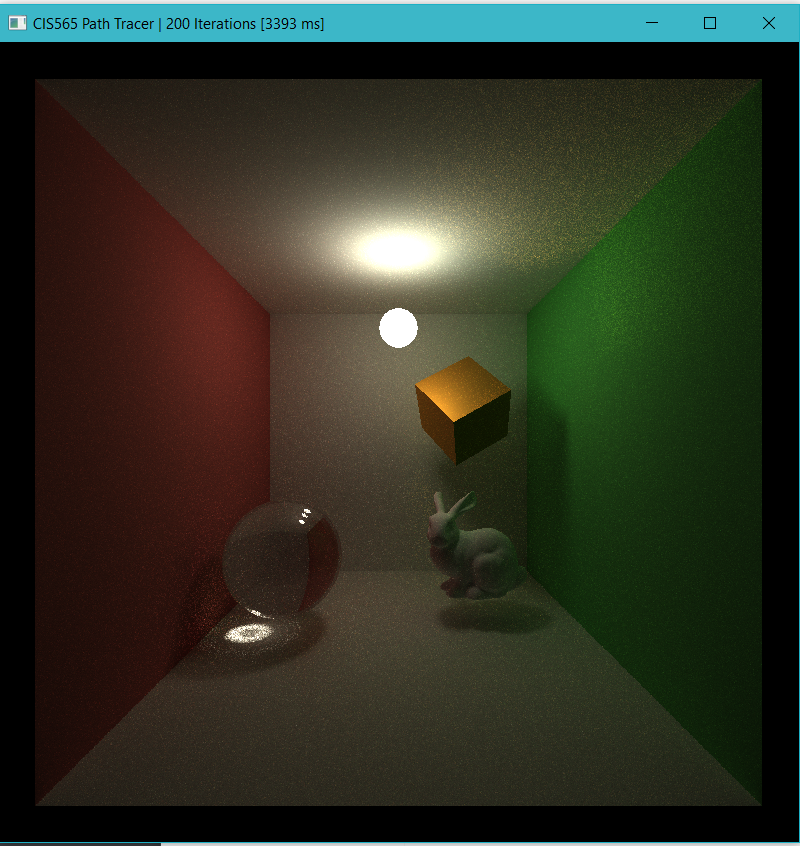
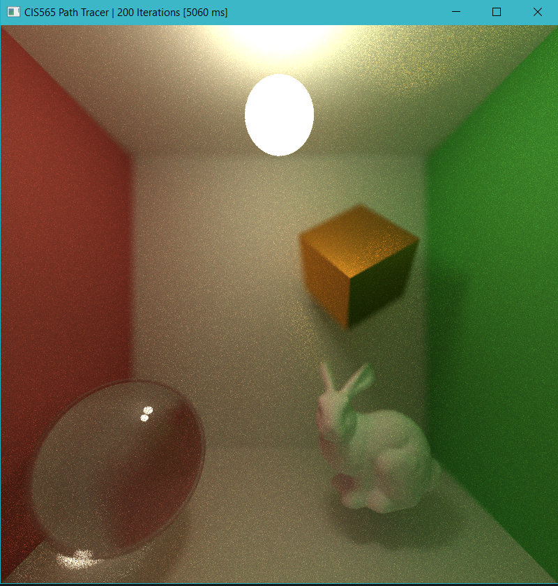

CUDA Path Tracer
================

**University of Pennsylvania, CIS 565: GPU Programming and Architecture, Project 3**

* Jian Ru
* Tested on: Windows 10, i7-4850 @ 2.3GHz 16GB, GT 750M 2GB (Personal)

### Results and Analysis

#### List of features
* MIS - Multiple Importance Sampling
* BVH - Used Surface Area Heuristic. Construction done on CPU
* Mesh loading and rendering - tinyobj for loading. Self-implemented triangle intersection test (Moller Trumbore's method)
* Path regeneration
* Materials - Glass (Fresnel)/Mirror/Lambert
* Depth of field
* Stratified jittering AA

#### Results

#### Analysis
* Methodology
  * Performance analysis was performed under the following context unless otherwise specified
  * Image dimension: 800 x 800
  * Execution time: the time for one pathtrace() call in milliseconds
  * Standfard scene: cornell box with a sphere and a cube
* A problem with random number generation
  * Monte Carlo method estimate integrals through random processes and hence relies on well distributed sampling pattern. All the sampling (cosine-weighted hemisphere sampling, cone sampling, concentric disk sampling, etc.) is based on a cannonical uniform distribution (i.e. between 0 and 1). If the assumption of uniform distribution doesn't hold, the results won't be correct.
  * The following image shows artifacts casued by incorrect random number generation. I forgot to update the depth value passed to the hashing function at the beginning. In this case, the skewed, correlated sampling pattern gives preference to certain directions on the hemisphere but this is not reflected in the pdf caculation. And the result is weird final color which is not easy to debug because there is no direct relation between the phenomenon and cause.
  *  
* MIS - cost and benefit
  * The following two images were rendered after 200 iterations using MIS and IS, respectively. It is obvious that MIS greately improves rate of convergence.
  * MIS is not free. The cost comes in as extra light source sampling and shadow ray intersection test for each path segement. The good thing is that this cost scales with image resolution (i.e. number of pathes) instead of scene complexity (unless there are materials that don't require light source sampling such as mirror or glass). In the standard scene, MIS cost about 100 ms on my machine which is about one fifth more expensive than IS. But obviously, the quality improvement is mcuh higher than the price. There is no way for IS to get the same quality if it is run the amount of time as MIS does.
  *  
* BVH - not always useful
  * My BVH implementation was a naive port from last year's CPU path tracer but instead of using a variable size container, std::vector, to simulate recursion stack, a fixed size array is used and hence impose a requirement on the maximum depth of the bvh hierarchy.
  * Surface area heuristic becomes extremely important here because it ensures a very balanced tree so greately reduce the height of the tree.
  * BVH is not always useful. When there are a very small number of primitives in the scene, BVH is actually much slower than bruteforce test (in the standard scene where only 8 primitives exist, BVH is more than 400 ms slower). But bruteforce quickly become infeasible when the scene complexity increases. When I add a stanford bunny (about 5,000 triangles) to the standard scene, bruteforce took more than 100,000 ms to finish one iteration (impossible without turning off TDR) while BVH took about 3,600 ms.
  * Even though BVH offers greate acceleration when there are lots of geometry in the scene, it is still way too slow (take more than 3 seconds to finish just one iteration of the bunny scene). If I have more time, a faster intersection test method will definitely be one of the most important things in the todo list.
  *  
  *  
* Path regen vs. removing/ignoring terminated threads
  * Instead of removing/ignoring terminated threads using stream compaction, I tried path regeneration approach from the Wavefront Path Tracing paper. The basic idea is that a new path from the camera will replace a terminated path in each sub-iteration. The color of the terminated path is saved before being overwritten and the new path will have the same pixel index as the old one.
  * The point is that we will always have enough work/threads for the GPU to execute and therefore improves performance by increasing utilization rate of GPU. This scheme is benefitial if your GPU has vacant power/resource to execute more threads.
  * Even though path regen eliminate the need to perform stream compaction, a sort on the path according to their material type is still benefitial because nearby threads will likely to run the same material code and thus reduce execution divergence.
  * Interesting enough. Experimentation shows that removing/ignoring terminated paths gives higher number of finished paths per milliseconds. I think this may due to several reasons. First, my GPU is not powerful enough to keep all threads alive anyway so path regen may keep too many threads alive and haence not increasing utilization. I am using the mega kernel approach for simplicity so it is possible that each thread uses too much resource and may again results in no increase in utilization because the GPU is full already. Many paths tend to terminate at the same time. Since I am using fixed depth instead of Russian-Roulette, except a small number of paths that escape the scene from opening, all paths end at max depth. So check for regeneration after each depth may not be that helpful. Regen kernel usually operate with high code and data divergence and it also increases divergence in following stages because it only operate on terminated paths which may be scattered after the shading stage. Restoring coherency is possible by using extra sorting of path indices but I found out through experiment that there is not obvious improvement possibly because the cost of sorting is basically the same as the slowdown cost by divergence.
  * Even though the experiment shows no benefit from path regen, more tests are needed. I think path regen should improve performance given a careful designed algorithm/workflow that minimizes divergence and a powerful enough GPU that can actually keep a large number of threads alive.
  * 
* Path sorting - index or actual data?
  * Increasing data coherency is good but sorting is not free. In the flocking project, each boid was only represented using two float3 and the algorithm requires acessing data of neighbouring boids. Therefore sorting the actual data was able to improve performance by a reasonable factor due to increased cache hit-rate. But in this project, paths are assumed to be independent and each path also has much larger size of data to hold its state. Sorting the actual data become infeasible here.
  * Instead of sorting the actual data, I sort the indices of the paths and find that this improves performance. Execution time is reduced by about 60 ms in the standard scene.
  * 
* Open scenes vs. closed scenes
  * Test was performed on an open and a closed cornell box.
  * As expected, the execution time is longer in the closed scene because fewer rays terminate due to entering void and hence the shading kernel usually has more work to do. The closed scene is also brighber because no rays can escape.
  *  
